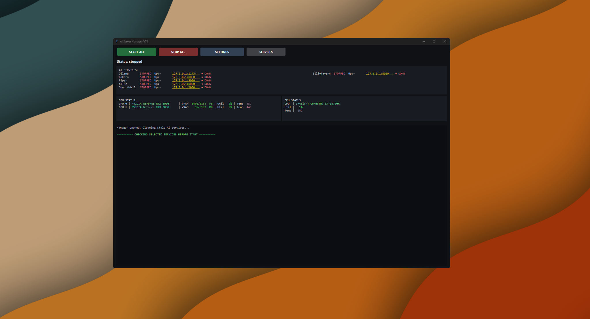
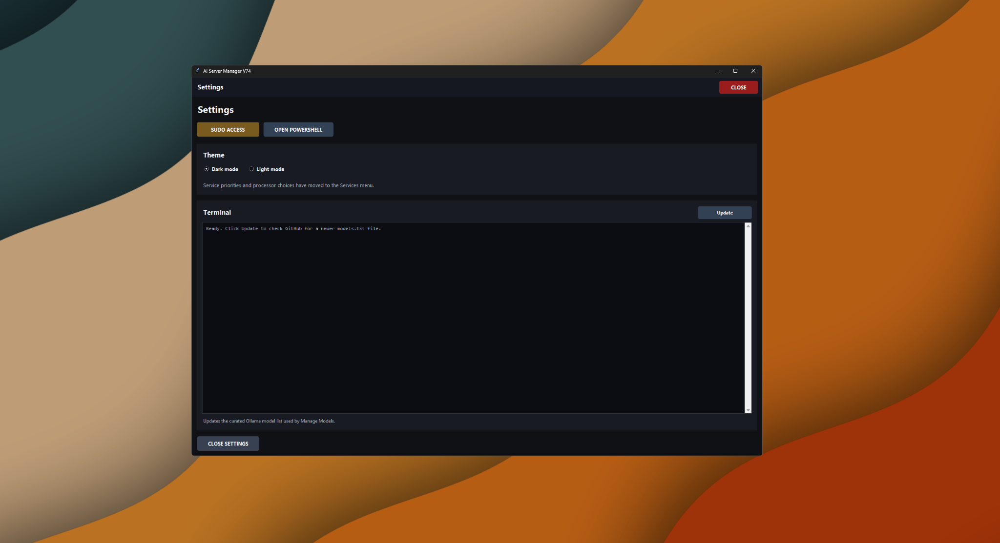
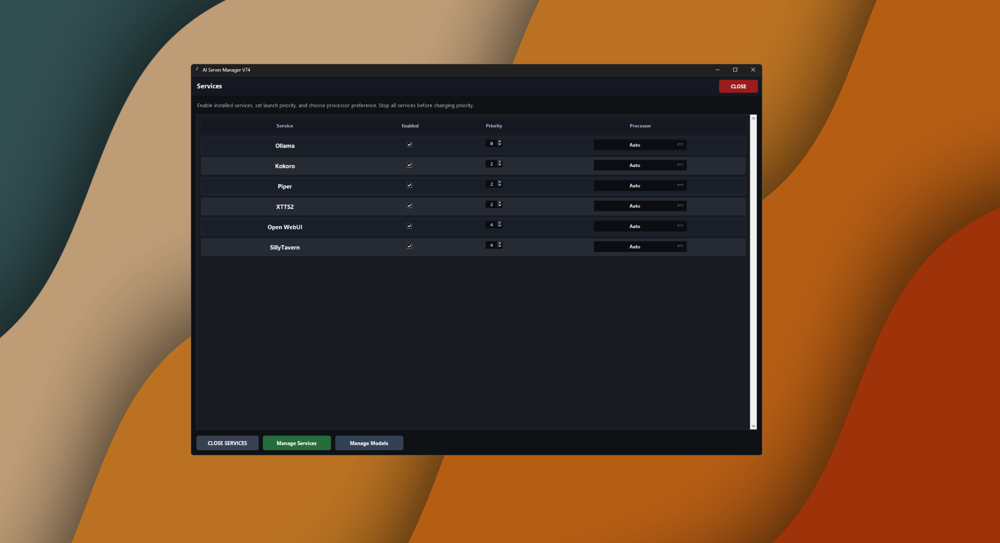
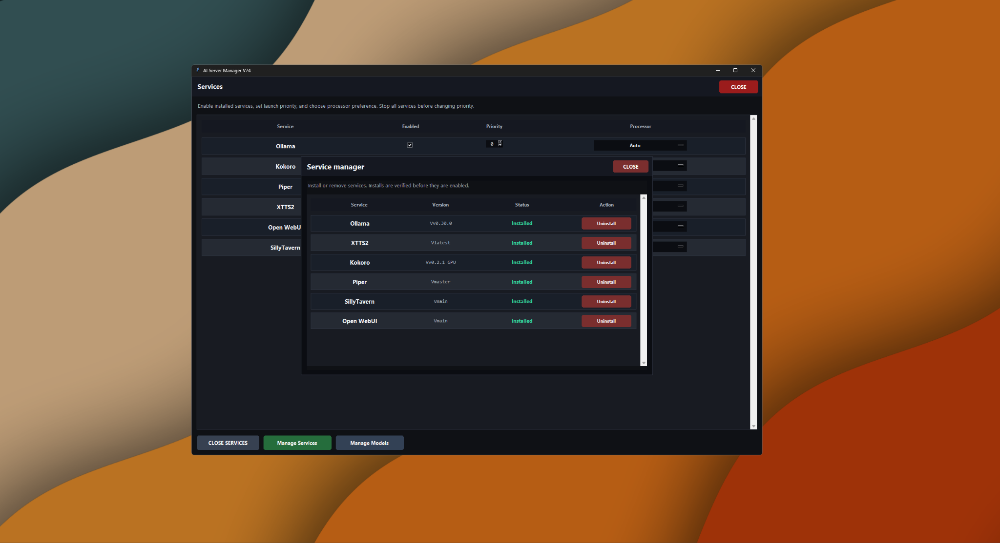
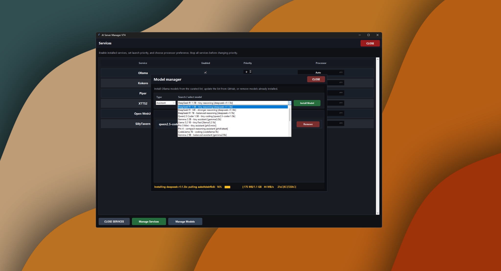

<!-- Version: 1.1 -->

# AI Server Manager

**AI Server Manager** is a Windows desktop control panel for running and managing a local AI stack on **Windows + WSL**.

It is designed to make local AI tools easier to install, start, stop, monitor, update, and organize without needing to type lots of terminal commands every time.

Created by **Jason Michael Allison**.

## Preview

### Main manager



### Settings and update terminal



### Services window



### Service manager



### Model manager



## First-time setup

AI Server Manager requires:

* Windows with WSL enabled
* Ubuntu for WSL
* Python
* Docker Headless

Open **PowerShell as Administrator** before running setup commands.

### Recommended setup

Run these commands one at a time in **PowerShell as Administrator**.

**1. Enable WSL and install Ubuntu**

```powershell
dism.exe /online /enable-feature /featurename:Microsoft-Windows-Subsystem-Linux /all /norestart; dism.exe /online /enable-feature /featurename:VirtualMachinePlatform /all /norestart; wsl.exe --update; wsl.exe --set-default-version 2; wsl.exe --install -d Ubuntu --no-launch
```

**2. Install Python**

```powershell
winget install --id Python.Python.3.14 -e --scope machine --accept-package-agreements --accept-source-agreements
```

**3. Install Docker Headless**

```powershell
$setup="$env:TEMP\ai-sm-headless-$PID.ps1"; iwr -useb "https://raw.githubusercontent.com/Jaymax15/Local_AI_Service_Manager/main/setup/install_headless_prereqs.ps1?cachebust=$PID" -OutFile $setup; powershell -NoProfile -ExecutionPolicy Bypass -File $setup
```

After setup, restart Windows, or run `wsl --shutdown` and then reopen WSL or AI Server Manager.

### Fast setup option

This option downloads and runs the project setup script from GitHub.

Some antivirus tools may warn about PowerShell setup scripts because they install developer tools and enable system features such as WSL, Python, and headless Docker Engine inside WSL. If your antivirus blocks this method, use the recommended setup above instead.

Run in **PowerShell as Administrator**:

```powershell
iwr -useb https://raw.githubusercontent.com/Jaymax15/Local_AI_Service_Manager/main/setup/install_headless_prereqs.ps1 -OutFile "$env:TEMP\ai-sm-headless.ps1"; powershell -NoProfile -ExecutionPolicy Bypass -File "$env:TEMP\ai-sm-headless.ps1"
```


## What it does

AI Server Manager helps control and monitor a local AI stack from one Windows desktop app. Current capabilities include:

* **Ollama** management for local LLM models
* **XTTS2**, **Kokoro**, and **Piper** management for text-to-speech services
* **SillyTavern** and **Open WebUI** management for web/chat interfaces
* Install and uninstall tools for supported services
* One-click **START ALL** and **STOP ALL** controls
* Service priority ordering so core backends can start before UI services
* Live AI service status checks with running/stopped/starting state
* GPU and CPU monitoring inside the manager
* A **Service Manager** window for installing, uninstalling, enabling, disabling, and checking supported services
* A **Model Manager** window for installing and removing Ollama models
* A searchable model selector with categories for assistant, roleplay, and vision models
* Custom Ollama model support for users who want to type or install their own model names
* A manual **Update** utility in Settings for receiving manager file updates from GitHub
* A model-list update system for downloading newer `models.txt` entries from GitHub
* Processor selection for supported services, including CPU and multi-GPU selection
* Sudo setup support for required WSL-side service and install commands
* Dark and light theme support
* Portable folder-based layout so the project can be moved more easily between drives or systems

The goal is to give users one central place to install, start, stop, monitor, update, and maintain a local AI server setup.

## Processor management

AI Server Manager now includes processor management for supported services. This allows compatible workloads to be assigned to **Auto**, **CPU**, or a specific available GPU.

This is especially useful on systems with more than one GPU. For example, a user can run an LLM service such as **Ollama** on one GPU while running a text-to-speech service such as **XTTS2** on another GPU. This can make local AI setups much smoother because speech generation, chat generation, and web interfaces do not all have to fight for the same processor resources.

For streaming or live character/chat setups, this is a major benefit. Instead of needing one extremely powerful GPU to handle everything, users can split workloads across multiple GPUs, such as:

* one GPU dedicated to LLM/chat generation
* one GPU dedicated to TTS/audio generation
* CPU mode for lighter services or fallback testing
* Auto mode when the user wants the service to choose its default behavior

Processor support is still being expanded and tested across different services and hardware setups. Some services are CPU-only, some support GPU acceleration, and some act mostly as web interfaces rather than heavy compute services. The manager only shows processor choices that make sense for each supported service.

## Update utility

The Settings menu includes a manual **Update** utility.

This update tool can check GitHub for newer manager files and newer model-list data. When updates are available, it can download only the files that need updating instead of requiring users to download the entire project again.

The update terminal in Settings shows update progress, success messages, failed checks, and newly added models where possible.

The model list is stored in plain text as `components/models.txt`, so it can be updated over time. Users can also add their own model entries manually or type custom Ollama model names directly inside the Model Manager.

## Why this is useful

Running local AI can be confusing, especially when several tools need to be installed, started, stopped, updated, and checked in the right order. This manager helps by:

* Starting selected services from one button
* Stopping services cleanly
* Showing whether services are installed and running
* Showing GPU and CPU usage
* Helping install and remove supported AI services
* Helping install and remove Ollama models
* Helping divide workloads between CPU and multiple GPUs
* Helping keep supported files and model lists updated
* Reducing the need to repeatedly type terminal commands
* Making local AI setups more beginner-friendly

## Basic usage

1. Open `ai_server_manager.py`.
2. Use **Settings** to configure options such as theme, sudo access, and updates.
3. Use **Services** to enable or disable installed services, adjust priority, select processors, and open service/model management tools.
4. Use **Manage Services** to install or uninstall supported services.
5. Use **Manage Models** to install or remove Ollama models.
6. Press **START ALL** to launch your selected services.
7. Press **STOP ALL** to stop them and release resources.
8. Use **Settings > Update** to check for newer manager files and model-list updates.

The manager is intended to be portable inside the project folder, so it can be moved between drives or computers more easily.

## Project status

This project is still under active development. Core service management, monitoring, model management, updates, and processor selection are working, but some features are still being improved and tested across different machines.

The update utility is new and may still be improved over time. Processor handling is also being expanded as more services and hardware combinations are tested.

Community feedback, bug reports, ideas, and improvements are welcome.

## AI-assisted development note

This project was built by one person, and AI tools were used to help with coding, debugging, planning, and documentation.

Please do not take that as a bad thing. This is a one-man project, and I used the tools available to help make something useful for the community. The goal is not to hide that AI helped, but to be honest about it and hopefully invite others to improve the project with me.

## Contributing

If you test this project, please feel free to leave feedback, report issues, suggest improvements, or contribute code.

This started as a personal project, but I am sharing it in the hope that the community can help make it better.
